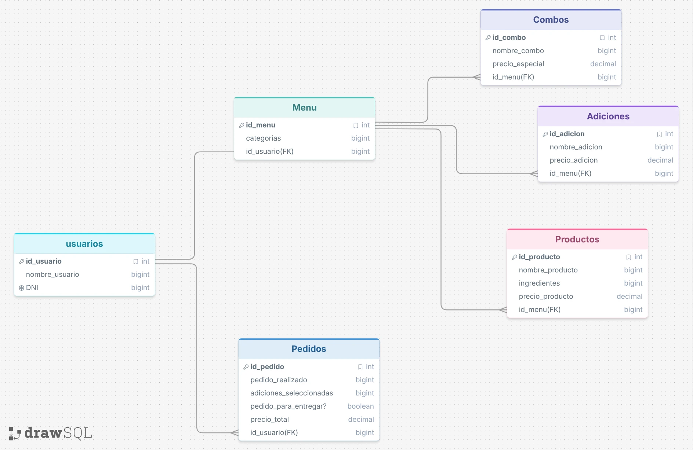

# PizzeriaCampus - README

## Descripción General

**PizzeriaCampus** es un proyecto de base de datos desarrollado en MySQL para la gestión de una pizzería. El sistema permite administrar información relacionada con usuarios, menús, productos, adiciones, combos y pedidos realizados por los clientes.

El objetivo principal del proyecto es diseñar una base de datos relacional que permita almacenar y consultar información relevante sobre las operaciones de la pizzería, facilitando el análisis de ventas, preferencias de los clientes y comportamiento de los pedidos.

## Estructura del Proyecto

La base de datos está compuesta por las siguientes tablas:

* **usuarios:** almacena la información de los clientes registrados.
* **Menu:** contiene las categorías disponibles dentro del menú.
* **Productos:** registra los productos ofrecidos por la pizzería.
* **Adiciones:** almacena los ingredientes o complementos adicionales que pueden agregarse a los productos.
* **Combos:** contiene los combos promocionales disponibles para los clientes.
* **Pedidos:** registra las compras realizadas por los usuarios.

## Requisitos

Para ejecutar el proyecto es necesario contar con:

* MySQL Server 8.0 o superior.
* MySQL Workbench (opcional).
* Permisos para crear bases de datos y tablas.

## Instrucciones de Ejecución

### 1. Crear la Base de Datos

Ejecute el archivo SQL principal que contiene las instrucciones `CREATE DATABASE`, `CREATE TABLE` y las restricciones de integridad referencial.

### 2. Insertar los Datos de Prueba

Una vez creadas las tablas, ejecute las sentencias `INSERT INTO` suministradas en el proyecto para poblar la base de datos con información de ejemplo.

### 3. Ejecutar las Consultas

Después de cargar la información, ejecute las consultas SQL incluidas en este documento para obtener los resultados solicitados.

## Consultas SQL

El proyecto incluye un conjunto de consultas orientadas al análisis de la información almacenada. Entre ellas se encuentran:

1. Productos más vendidos.
2. Total de ingresos generados por cada combo.
3. Pedidos realizados para recoger versus consumir en el local.
4. Adiciones más solicitadas.
5. Cantidad total de productos vendidos por categoría.
6. Promedio de pizzas pedidas por cliente.
7. Total de ventas registradas.
8. Cantidad de panzarottis vendidos con extra queso.
9. Pedidos que incluyen bebidas.
10. Clientes con más de cinco pedidos.
11. Ingresos generados por productos no elaborados.
12. Promedio de adiciones por pedido.
13. Total de combos vendidos.
14. Clientes con pedidos para entrega y consumo local.
15. Total de productos personalizados con adiciones.
16. Pedidos con más de tres productos diferentes.
17. Promedio de ingresos por pedido.
18. Clientes que solicitan pizzas con adiciones en más del 50% de sus pedidos.
19. Porcentaje de ventas provenientes de productos no elaborados.
20. Día de la semana con mayor número de pedidos para recoger.

# Los resultados de las consultas se veran reflejados en en el archivo Consultas.sql subido al repositorio con los demas archivos.

## Explicación de las Consultas

Cada consulta fue desarrollada utilizando las relaciones existentes entre las tablas de la base de datos. Se emplearon operaciones como:

* JOIN para relacionar información entre tablas.
* GROUP BY para agrupar registros.
* COUNT para contabilizar datos.
* SUM para calcular ingresos y ventas.
* AVG para obtener promedios.
* HAVING para filtrar resultados agrupados.
* LIKE para realizar búsquedas por patrones de texto.

Estas consultas permiten extraer información útil para la toma de decisiones dentro de la pizzería, como identificar productos populares, analizar el comportamiento de los clientes y evaluar el rendimiento de las ventas.

## Limitaciones del Modelo Actual

Algunas consultas requieren información que no se encuentra disponible en el modelo de datos actual. Por ejemplo:

* No existe una tabla de detalle de pedidos que permita almacenar múltiples productos por pedido.
* La tabla Pedidos no contiene una fecha de realización del pedido.

Debido a estas limitaciones, las consultas 16 y 20 no se pudieron realizar.

## Modelo Logico hecho en DrawSQL

## Conclusión

La base de datos PizzeriaCampus proporciona una estructura funcional para la administración de una pizzería y permite realizar diferentes análisis mediante consultas SQL. El proyecto demuestra la aplicación de conceptos fundamentales de bases de datos relacionales, integridad referencial y consultas avanzadas en MySQL.
